# PUBG Killfeed Country Flags

Customize your PUBG killfeed with clear, recognizable country flags!

---

## Available Versions

| Version               | Description                                                      | Download Link                                           |
|-----------------------|------------------------------------------------------------------|---------------------------------------------------------|
| **Observer**          | Original country flags without numbers                           | [Download Observer (No Numbers)](https://github.com/fekher-turki/PUBG-Killfeed-Flags-By-TF2wo/Observer.zip) |
| **Observer_Numbered** | Country flags with large team numbers for quick identification  | [Download Observer_Numbered (With Numbers)](https://github.com/fekher-turki/PUBG-Killfeed-Flags-By-TF2wo/Observer_Numbered.zip) |

---

## About

This repository contains a curated set of popular country flags used to improve killfeed clarity in PUBG.  
Flags are carefully selected to avoid confusion, making it easier for players to track kills and teams in real-time.

---

## Installation Instructions

1. Download the version you prefer from the links above.

2. Open Windows File Explorer and navigate to:
%LOCALAPPDATA%\TslGame\Saved

3. Copy the downloaded **Observer** folder (either with or without numbers) into the `Saved` directory.  
The folder must contain:  
- `TeamInfo.csv`  
- `TeamIcon` directory with flag images  

4. If you already have an existing `Observer` folder, **replace it** with the new one.

5. Restart PUBG to apply the new killfeed flags.

---

## Teams Overview

| Team # | Country Name    | Short Name | Main Color | Original Flag (no number)                    | Numbered Flag (with number)                     |
|--------|-----------------|------------|------------|----------------------------------------------|------------------------------------------------|
| 1      | China           | CHN        | #DE2910    |            |      |
| 2      | United States   | USA        | #3C3B6E    |            |      |
| 3      | United Kingdom  | GBR        | #00247D    |            |      |
| 4      | France          | FRA        | #0055A4    |            | 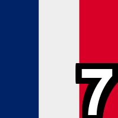     |
| 5      | Germany         | GER        | #000000    |            |      |
| 6      | Brazil          | BRA        | #009C3B    |            |      |
| 7      | Japan           | JPN        | #BC002D    |            | 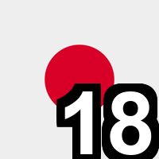     |
| 8      | Russia          | RUS        | #D52B1E    |            |      |
| 9      | South Korea     | KOR        | #C60C30    |            | 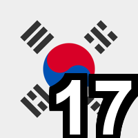     |
| 10     | Canada          | CAN        | #FF0000    |            |      |
| 11     | Spain           | ESP        | #AA151B    |            | 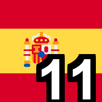     |
| 12     | Argentina       | ARG        | #74ACDF    |            |      |
| 13     | Turkey          | TUR        | #E30A17    |            |      |
| 14     | Sweden          | SWE        | #006AA7    |            | 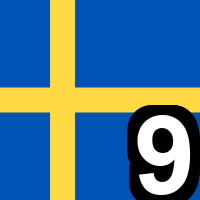     |
| 15     | Portugal        | POR        | #006600    |            | 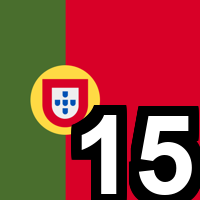     |
| 16     | South Africa    | RSA        | #007847    |            | 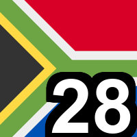     |
| 17     | Tunisia         | TUN        | #E70013    |            | 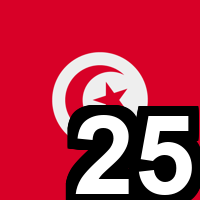     |
| 18     | India           | IND        | #FF9933    |            |      |
| 19     | Italy           | ITA        | #009246    |            |      |
| 20     | Australia       | AUS        | #00008B    | 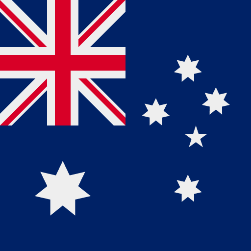           | 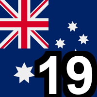     |
| 21     | Egypt           | EGY        | #CE1126    |            |      |
| 22     | Ukraine         | UKR        | #0057B7    |            |      |
| 23     | Saudi Arabia    | KSA        | #006C35    |            |      |
| 24     | Greece          | GRE        | #0D5EAF    |            |      |
| 25     | Switzerland     | SUI        | #FF0000    |            |      |
| 26     | Poland          | POL        | #DC143C    |            | 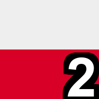     |
| 27     | Denmark         | DEN        | #C60C30    |            |      |
| 28     | Norway          | NOR        | #BA0C2F    | 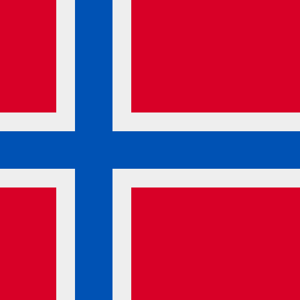           | 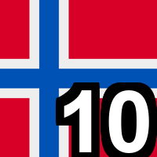     |
| 29     | Finland         | FIN        | #002F6C    |            | 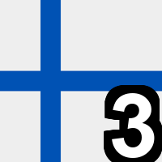     |
| 30     | Algeria         | ALG        | #006233    |            |      |
| 31     | Jamaica         | JAM        | #007847    |            |      |
| 32     | Qatar           | QAT        | #8A1538    |            |      |

---

## Contributions & Issues

Contributions, bug reports, and feature requests are welcome!  
Feel free to open issues or submit pull requests to improve the flags or update the teams.

---

*Enhance your PUBG experience with clearer, easier-to-read killfeed flags!*
